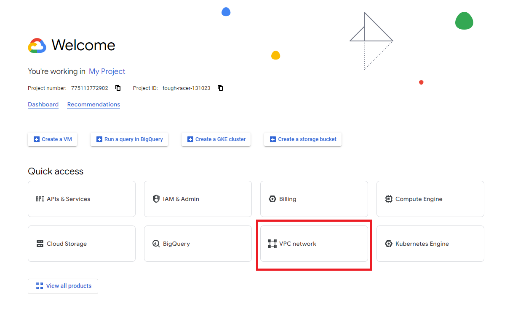
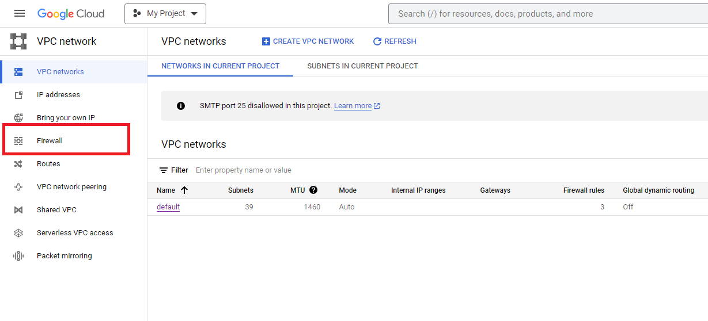
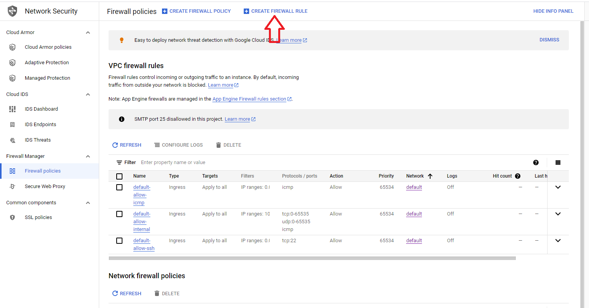
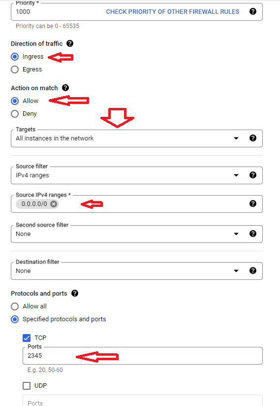
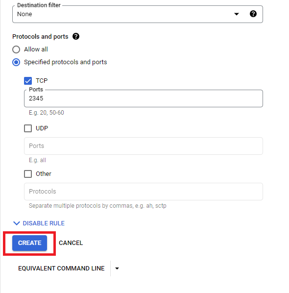

# Open Firewall on Google Cloud

## Step 1 - Locate firewall settings

### VPC network

Login to google cloud, select your project, choose VPC Network from quick access. If it not appear in Quick access then you may need to find it in View all products

### Firewall

From VPC network choose Firewall

## Step 2 - Create firewall rule

Choose Create Firewall Rule

Fill the firewall settings

* Direction of traffic: Ingress
* Action on match: Allow
* Targets: All instances
* Source IP: 0.0.0.0/0
* Port: the port you want to open eg: 2345

Click Create to create the rule

