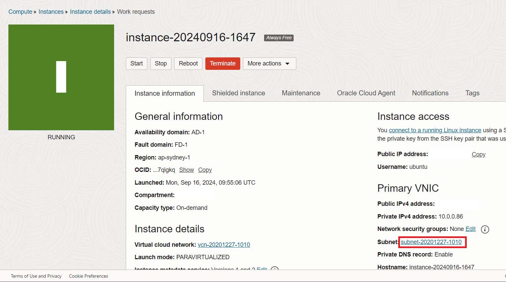
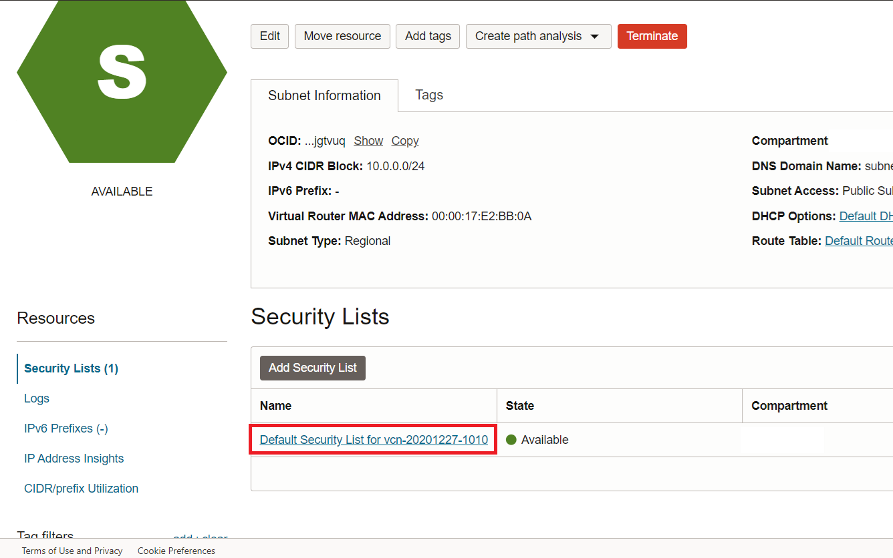
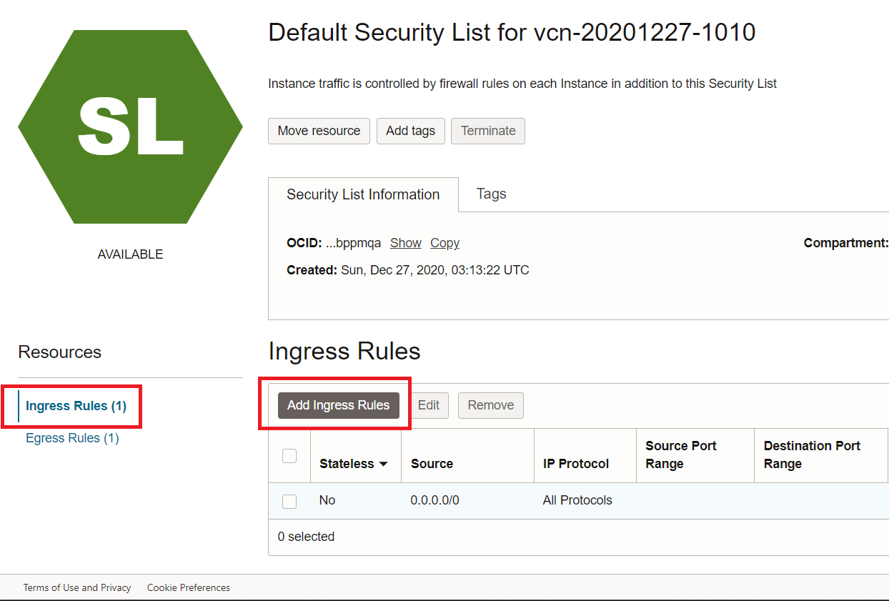
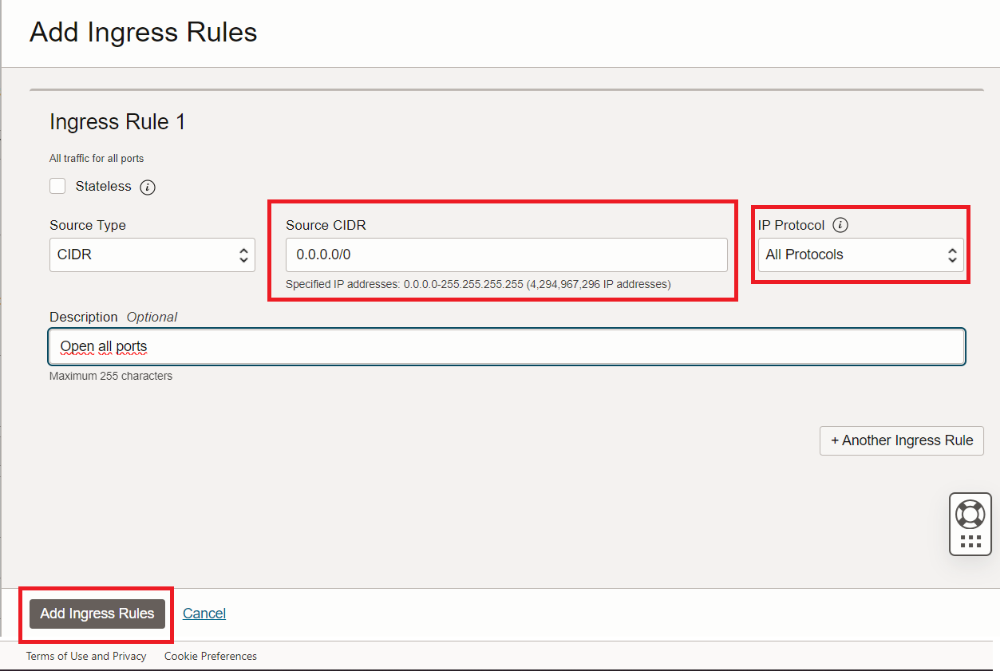

# Open Firewall on Oracle Cloud

From Instance detail click on subnet link

On subnet page, select Default security list

Then Add new Ingress rule

Open All ports by set Source to 0.0.0.0/0 and All Protocols

You may open specified port only by select TCP protocol, and input source and destination ports

