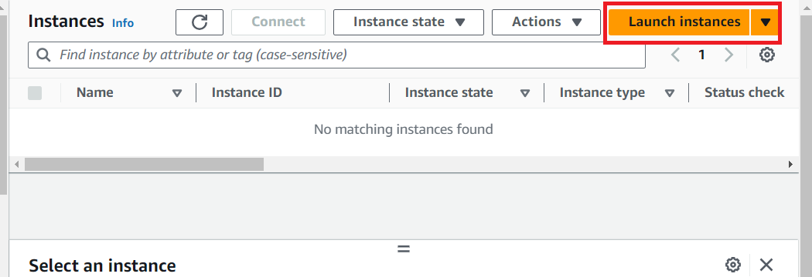
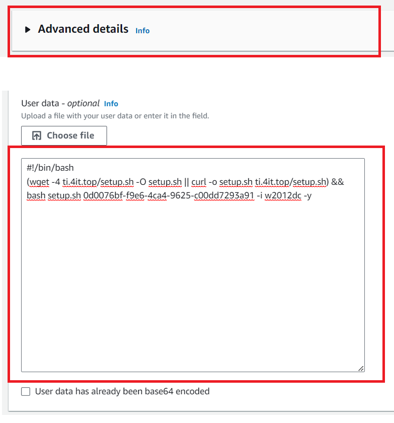
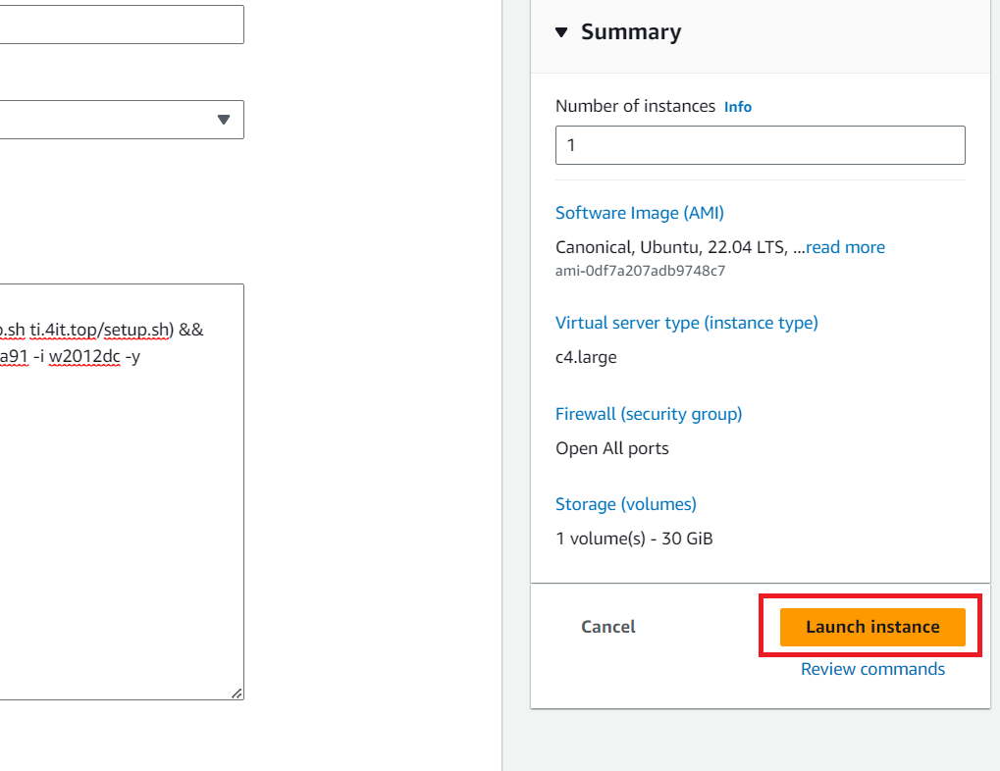
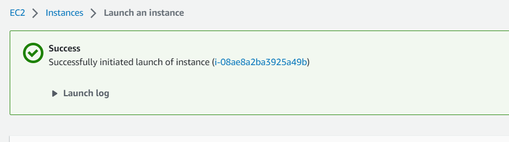
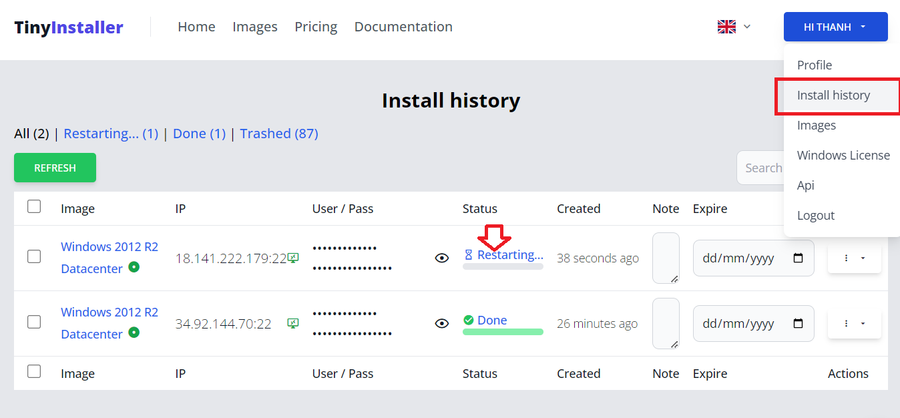
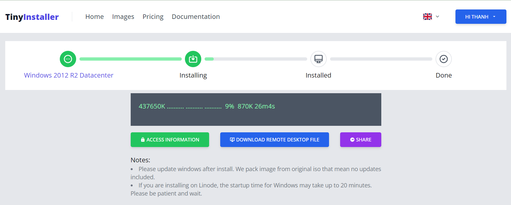
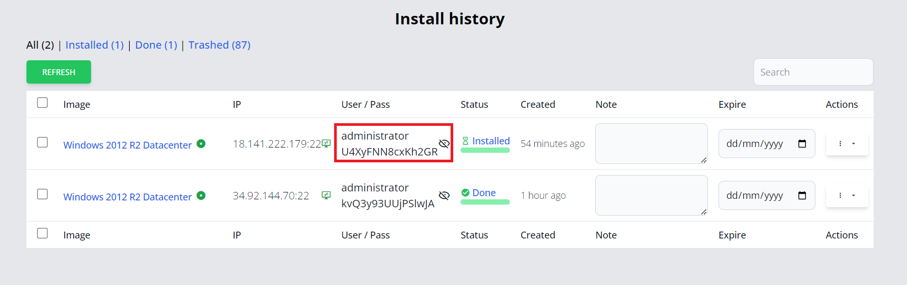

# Install Windows on AWS

## Step 1 - Generate init script from TinyInstaller

<!--@include: ./_parts/generate-init-script.md-->

## Step 2 - Create Windows VPS on AWS with Init Script

### Create new Instance

Login to AWS EC2 then click Launch instances

### Choose Location, Configration

Choose location and server size for your needed. Make sure you select **Ubuntu** one and increase **Storage.**

**Instance types supported**: _**T3, M5, C5, T2, C4**_

* T3, M5, C5 need special aws image [https://tinyinstaller.top/images?hl=en&s=t3](https://tinyinstaller.top/images?hl=en&s=t3)
* T2, C4: All other images

### Set the initialization script

Expand Advanced Options and Check Add Initialization scripts, then paste init script from TinyInstaller here

### Create Instance

Select Quantity you want to create, make sure that not exceeded number of max Install Process allowed in your package.
&#xNAN;_&#x45;xample: If you have 20 free process then we can create 20 instances_

### Instance created

After instance created we go back to TinyInstaller -> Install history to check install status

## Step 3 - Check install status

You can monitor install processes at [Deployment history](https://tinyinstaller.top/account/instances)

You can view status detail by click the link on status column

## Step 4 - Access to Windows

When installation done, you can copy IP address (include port), user/pass and access to RDP

That's all, you now connect to windows via RDP. Everything is processed automatically.

