# Install Windows on Azure

## Step 1 - Create Ubuntu VPS on Azure

### Create new Virtual Machine

Login to Azure then go to Virtual machines and click Create button

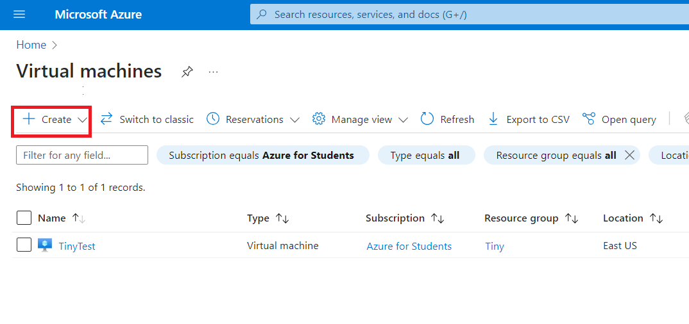

### Choose Location, Configration

Choose location and server size for your needed. Make sure you select correct **Security Type** and Image:

* Security type: **Standard**
* Image: **Ubuntu** (any ubuntu version)

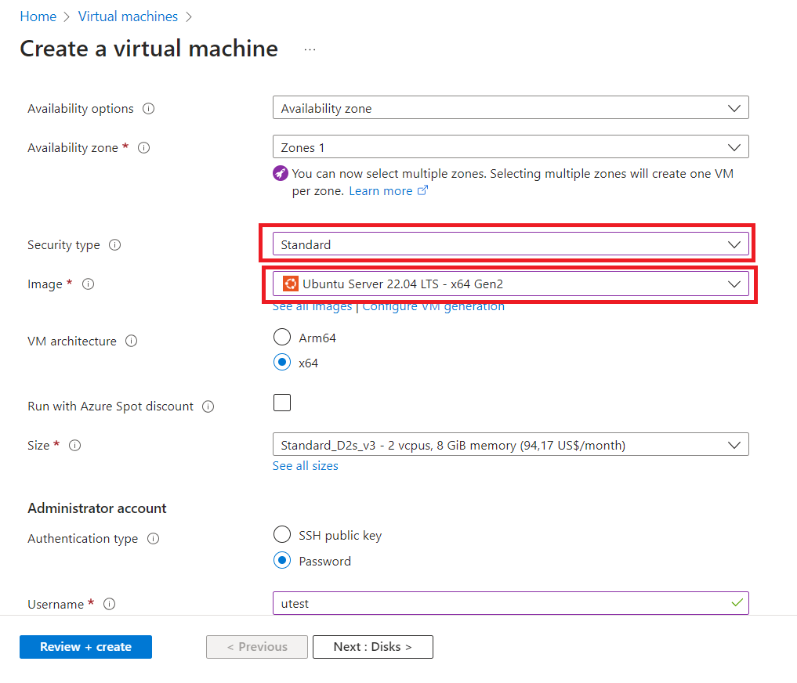

## Step 2 - Connect to Ubuntu VPS

In Bitvise SSH Client just fill in details and click login

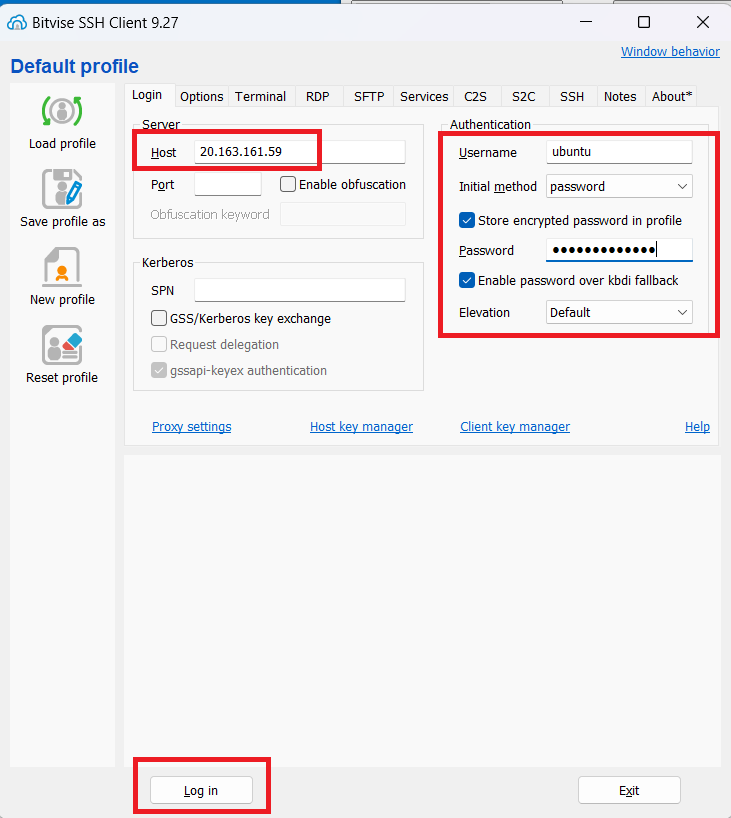

Then click New terminal console to open terminal

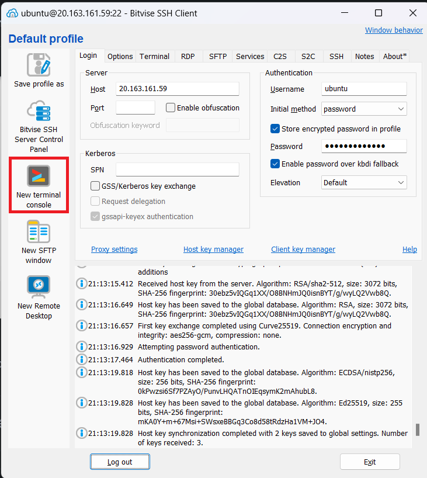

## Step 3 - Run Install command

Copy command from TinyInstaller

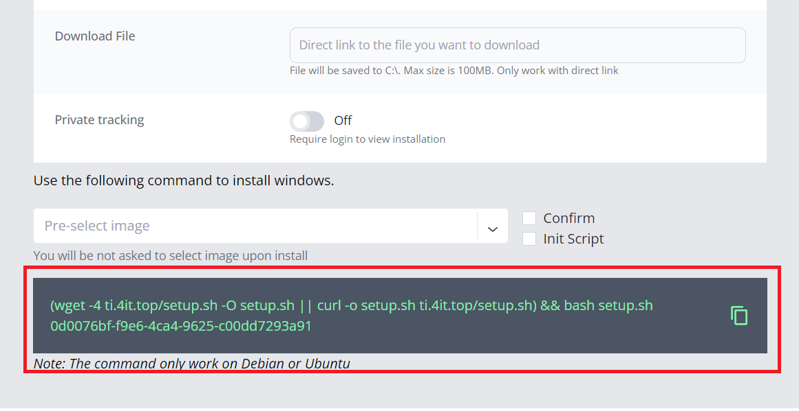

Then paste to Terminal Console we opened in previous step then press enter to run

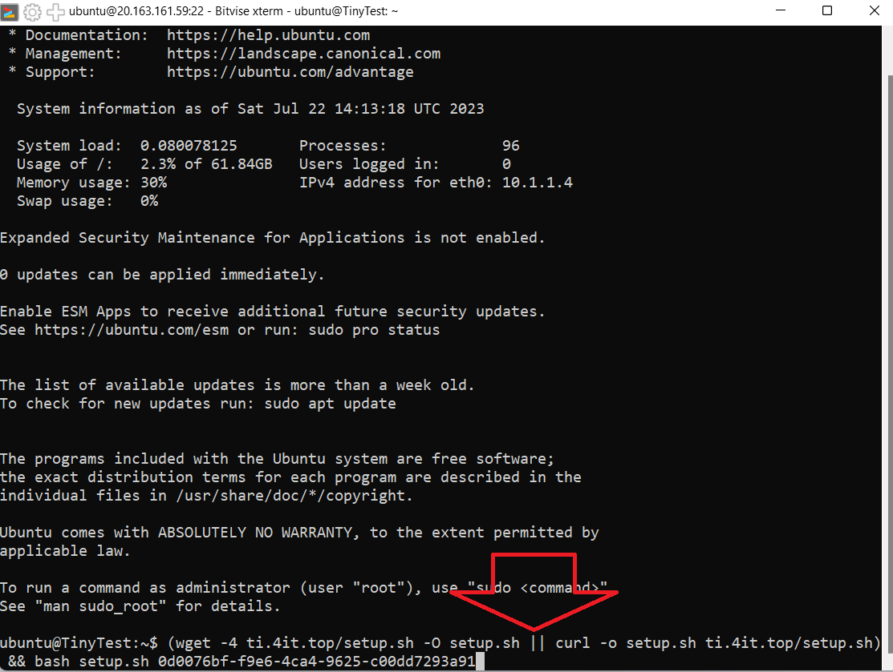

Choose image you want to install by choosing number from the list

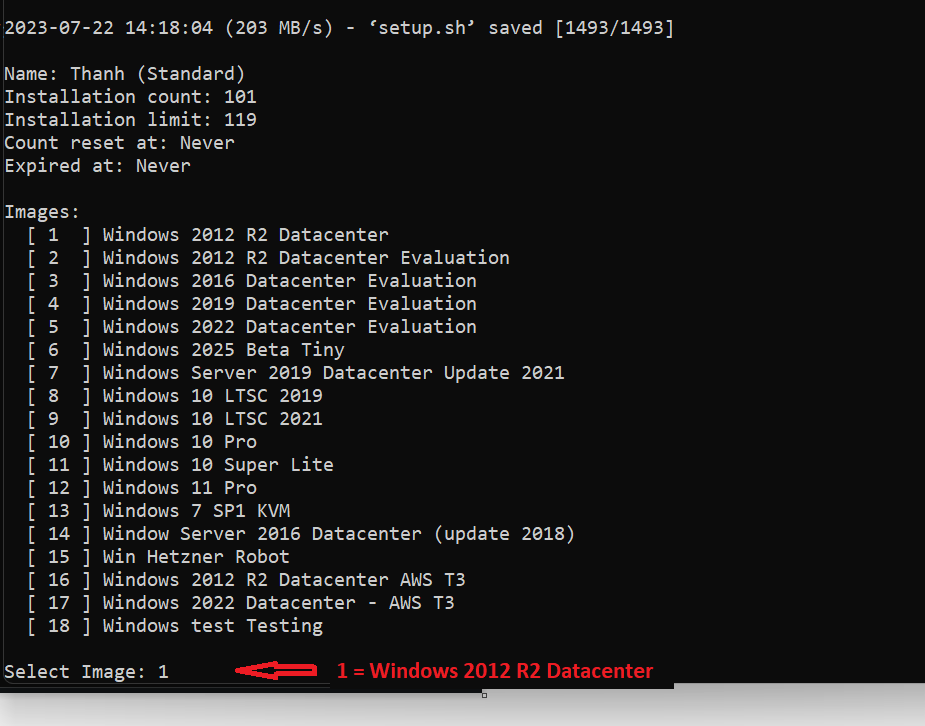

Answer y to confirm

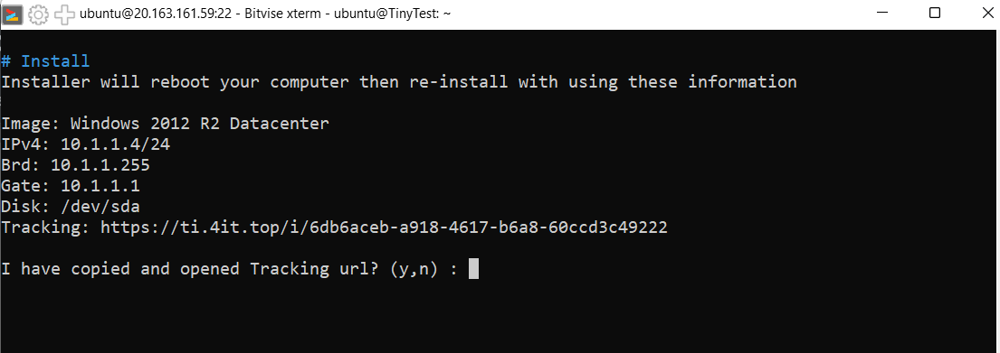

Now terminal will be disconnected, open tracking url on browser to see progress

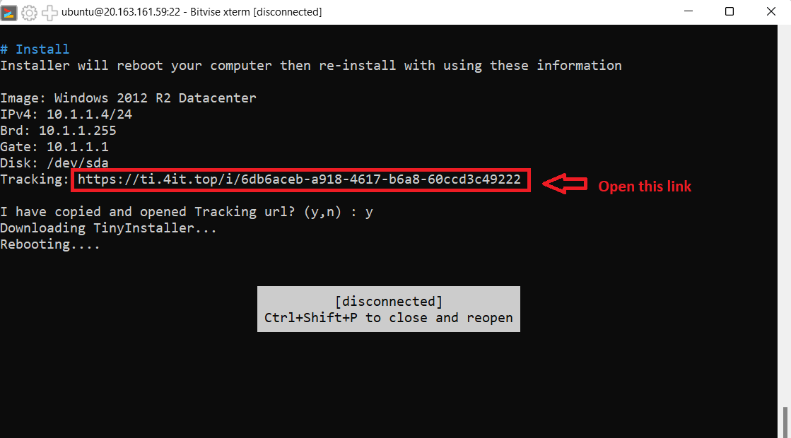

Wait until it done then you can access to RDP

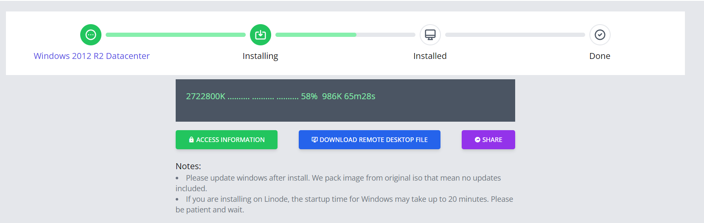

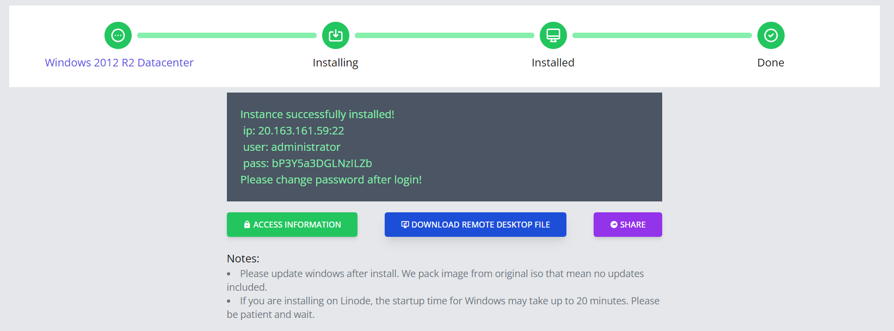

