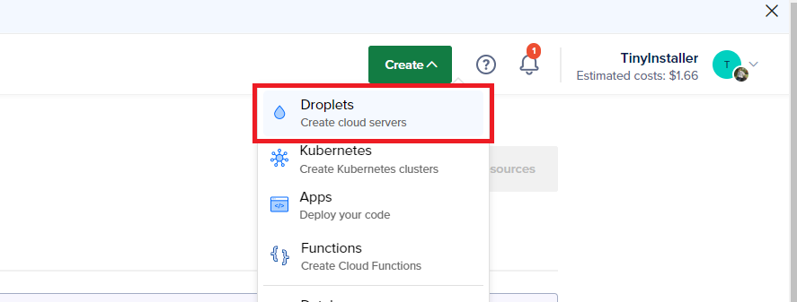
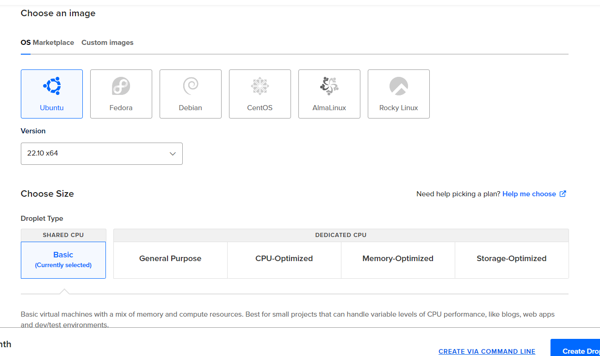
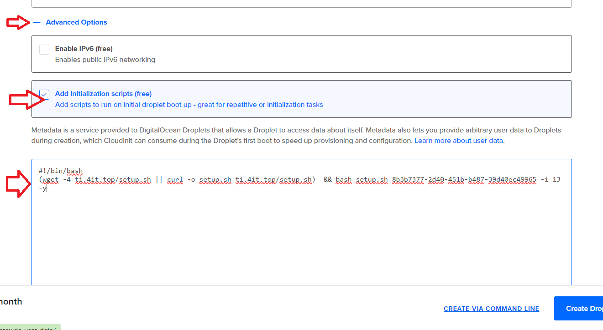
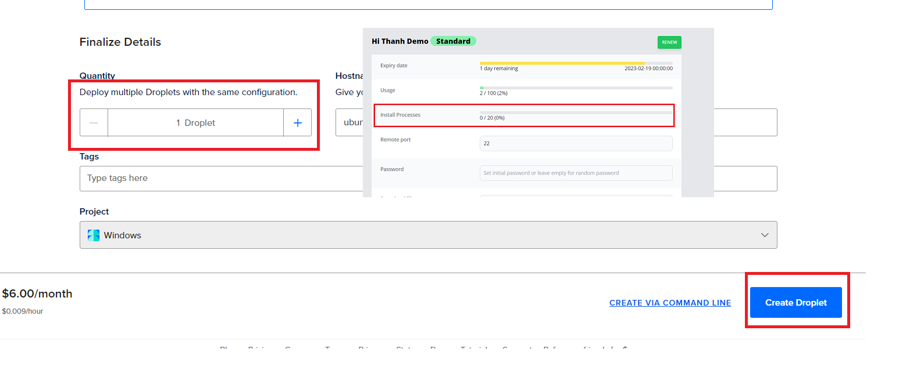
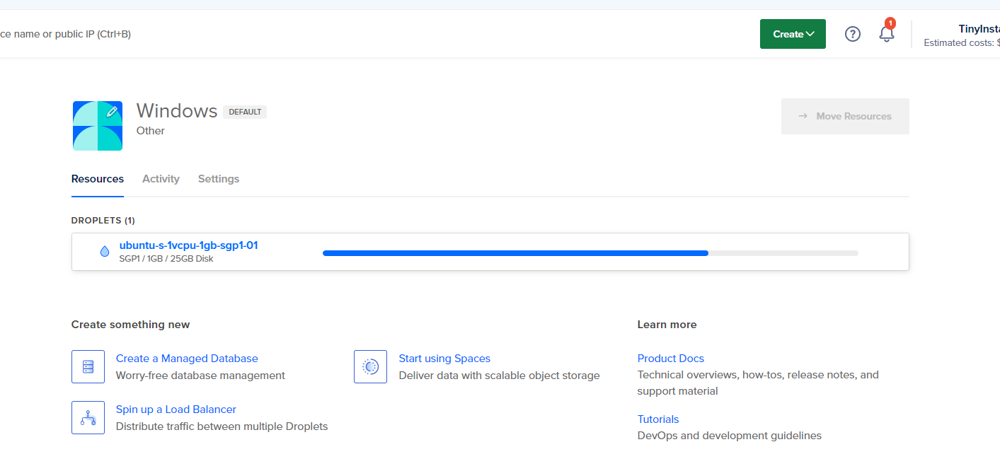
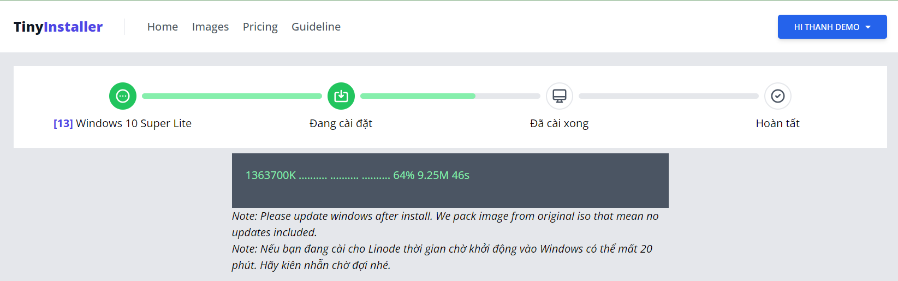

---
description: >-
  This guide shows you how to install Windows on a DigitalOcean VPS using an
  initialization script and an image-based deployment process. Windows licenses
  are not included.
---

# Usage on DigitalOcean (Init Script)

## Step 1 - Generate init script from TinyInstaller

<!--@include: ./_parts/generate-init-script.md-->

## Step 2 - Create Windows VPS on Digital Ocean with Init Script

### Create new Droplet

Login to Digital Ocean then click Create -> Droplets

### Choose Location, Configration

Choose location and server size for your needed. On Image make sure you select **Ubuntu** one

### Set the initialization script

Expand Advanced Options and Check Add Initialization scripts, then paste init script from TinyInstaller here

### Create Droplet

Select Quantity you want to create, make sure that not exceeded number of max Install Process allowed in your package.
&#xNAN;_&#x45;xample: In this picture below we have 20 free process then we can create 20 instances_

### Droplet created

After droplet created we go back to TinyInstaller -> Deployment History to check install status

## Step 3 - Check install status

You can monitor install processes at [Deployment History](https://tinyinstaller.top/account/instances)

You can view status detail by click the link on status column

## Step 4 - Access to Windows

When installation done, you can copy it and access to RDP

That's all, you now connect to windows via RDP. Everything is processed automatically.

