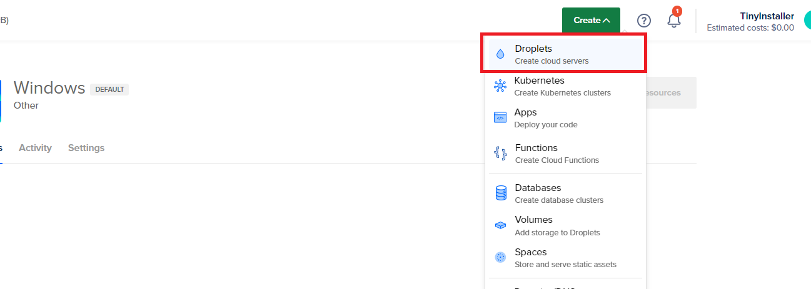
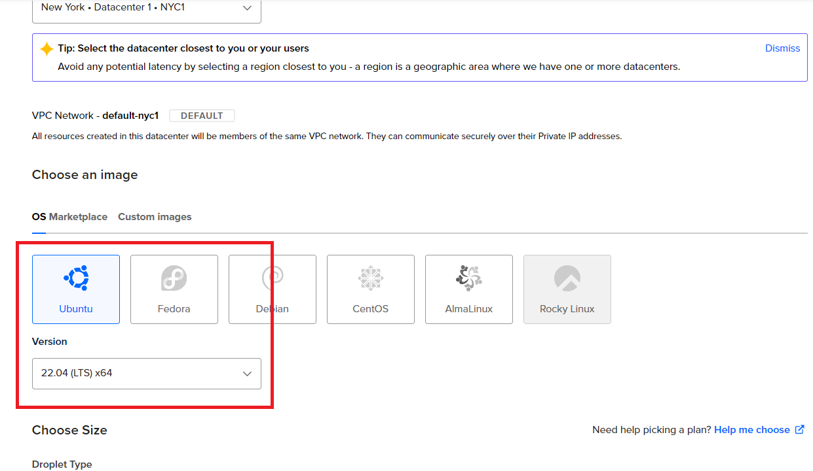
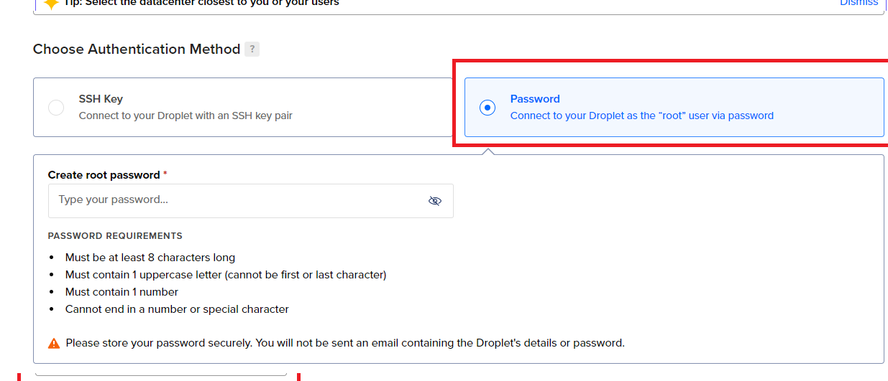
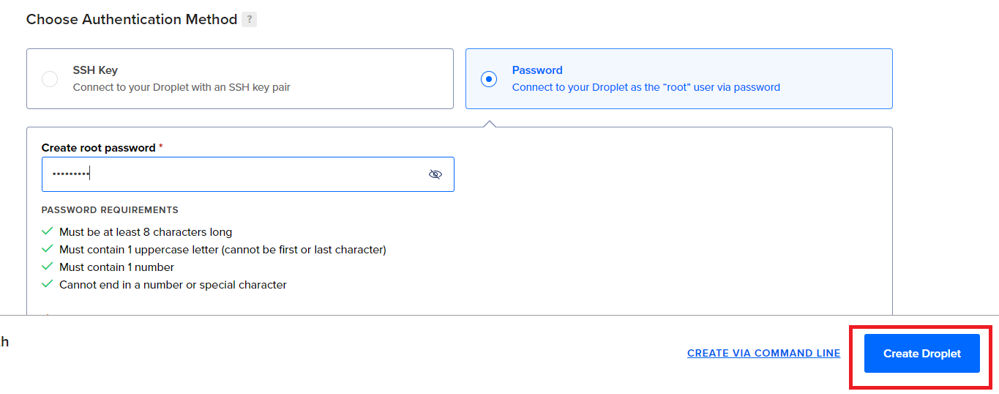

---
description: >-
  This guide explains how to create a Linux VPS on DigitalOcean and install
  Windows on it using a command-based, image deployment process. Windows
  licenses are not included.
---

# Usage on DigitalOcean

## Step 1 - Create Ubuntu VPS on DigitalOcean

Login to DO account then click Create -> Droplets

Choose your prefer location and on Images make sure you select Ubuntu one

Choose Password authentication method

Then Create the Droplet

After Droplet created successfully, move to step 2, connect to Ubuntu VPS with choosen password and run install command.

## Step 2 - Install Windows on VPS

Check below link to continue install windows on VPS which created above

[usage-on-any-linux-vps](usage-on-any-linux-vps)

