# Usage on Linode

Installation on Linode is not same with other providers, because we need to change boot setting to Direct Disk.

@[Linode guide](http://youtu.be/M9oUKKAFvzo)

**Note:** 

* If change to Direct Disk after status changed to "Installing" but before "Installed" => Don't need reboot
* If change to Direct Disk after status changed to "Installed" => Need reboot

***

We also able to use TinyInstaller's InitScript in Linode. If you want to use init script, please follow steps below

## Step 1 - Generate init script from TinyInstaller

<!--@include: ./_parts/generate-init-script.md-->

## Step 2 - Create Stack Script

Goto StackScripts and click Create Stack Script

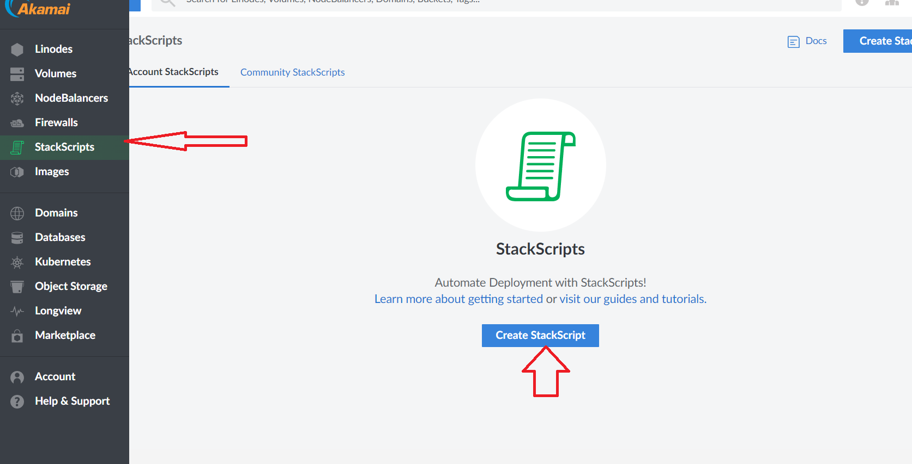

Enter script (copy from Step 1) here, make sure you select Debian 11 in Target Images

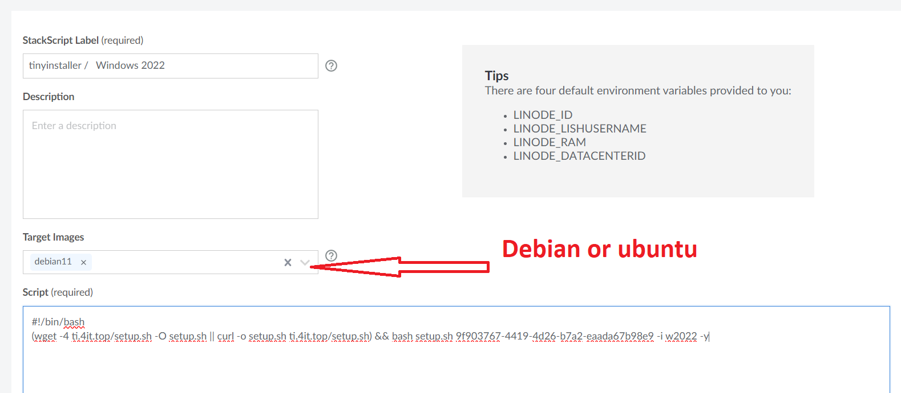

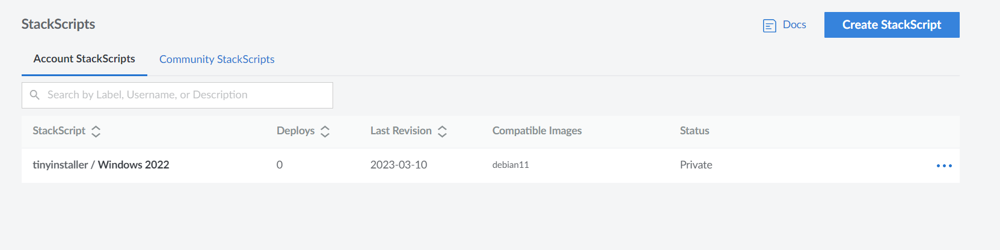

## Step 3 - Create Windows VPS on Linode with StackScript

In Linodes/Create screen select stack scripts tab then choose the stack which you created before

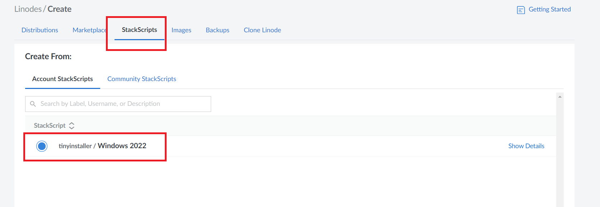

Click Create Linode to create

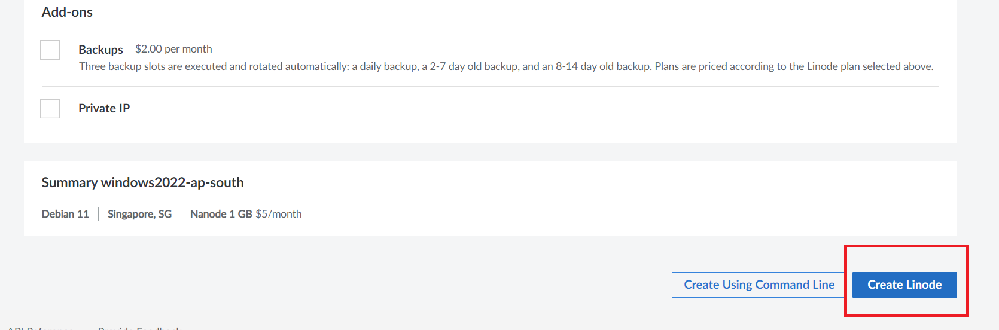

After instance is running then go back to TinyInstaller -> Deployment History to check install status

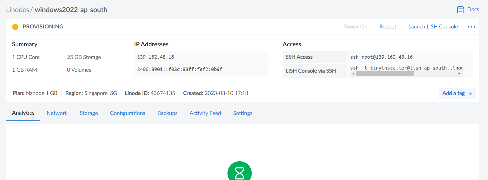

## Step 4 - Check install status

Go to [Deployment History](https://tinyinstaller.top/account/instances) you may check status there

**Please be patient and wait until you see your instance appear in the history list before moving to next step**

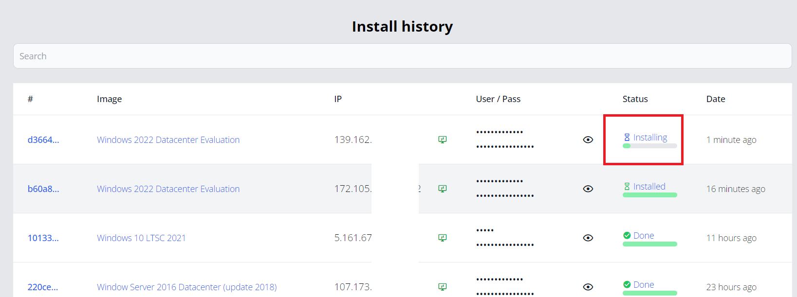

## Step 5 - Update Direct Disk (important)

After instance appear in TinyInstaller website we need to update Configuration in Linode. There are 2 valid points to update:

* If TinyInstaller show "Installing" then just update to Direct Disk
* If TinyInstaller show "Installed" then update to Direct Disk and Reboot

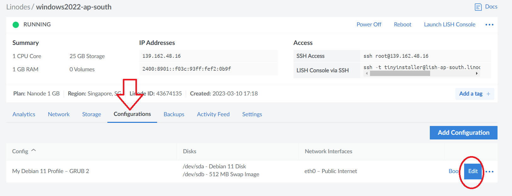

Change Boot Setting to Direct Disk then Save Changes

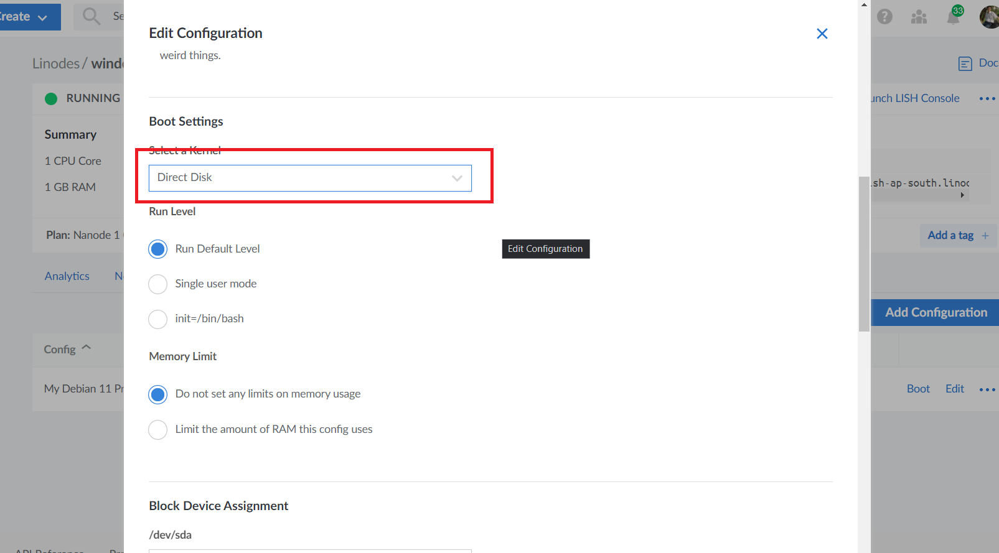

Reboot instance

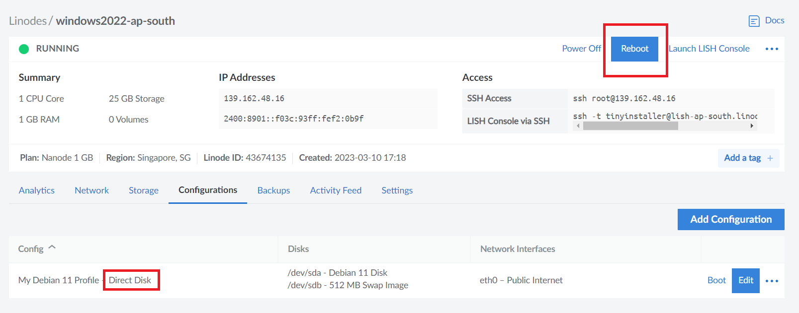

Wait it boots up and connect. It may take 10-15 min, please be patient. When you see Status changed to Done it's time to connect via RDP

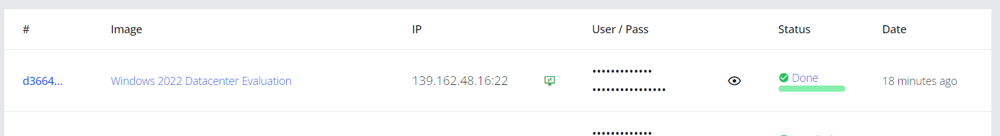

