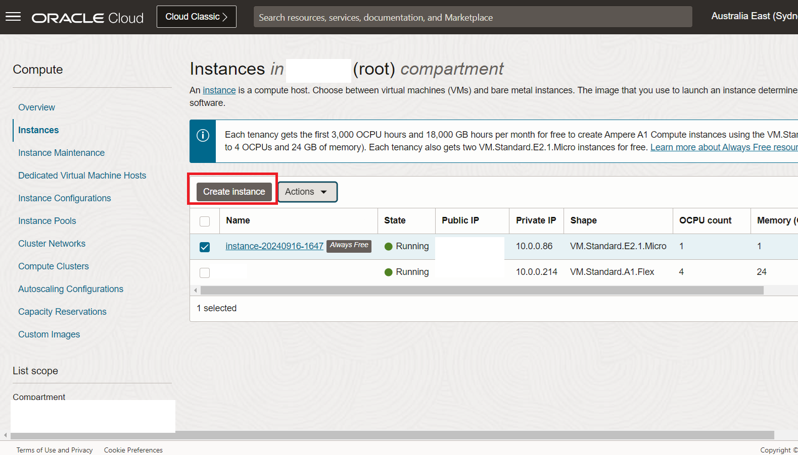
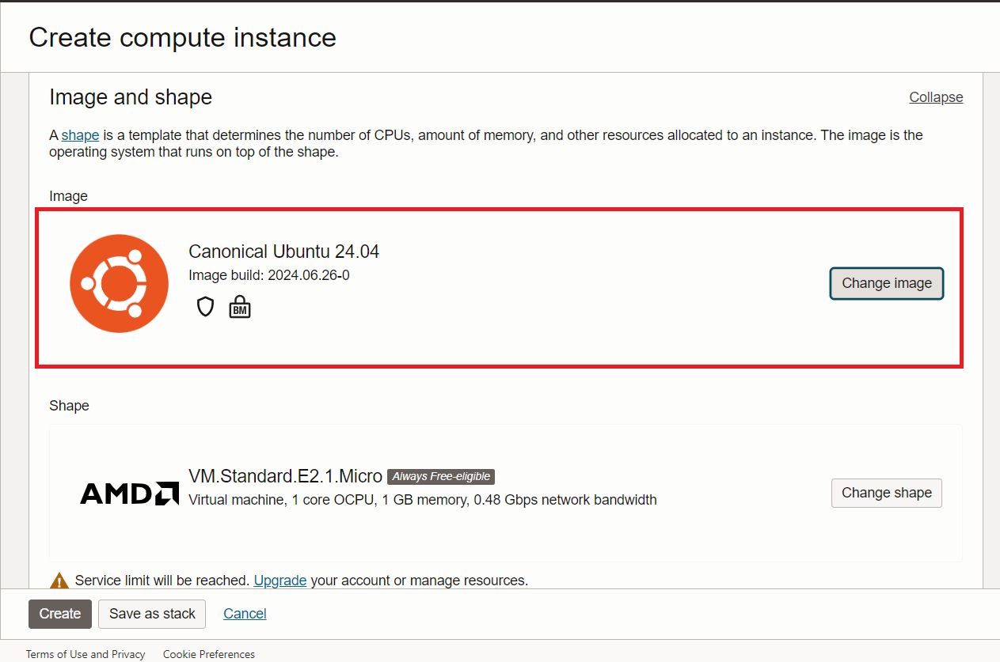
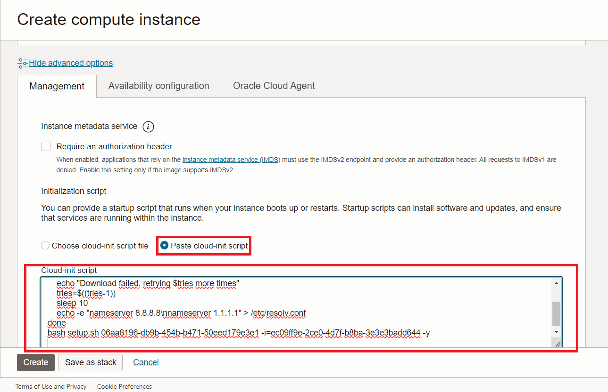
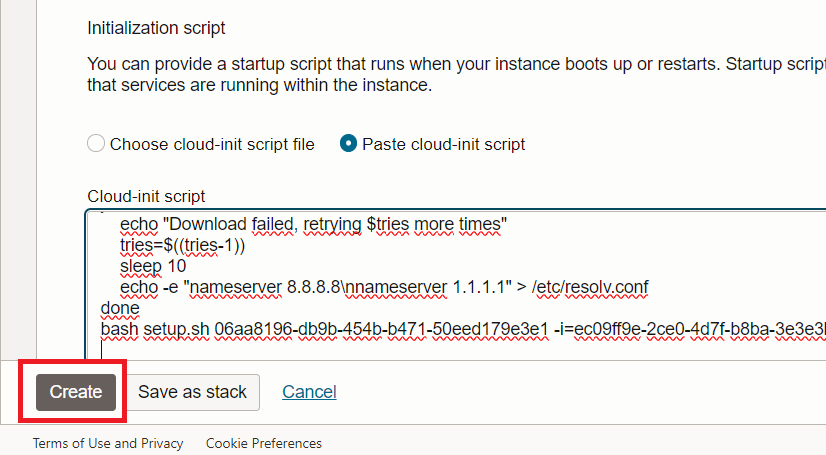
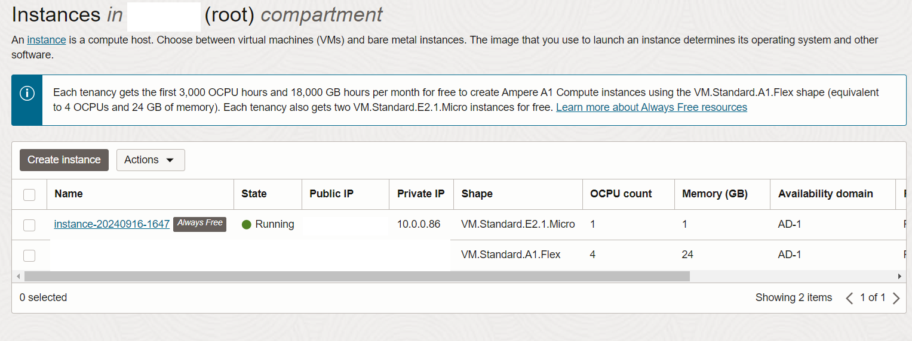
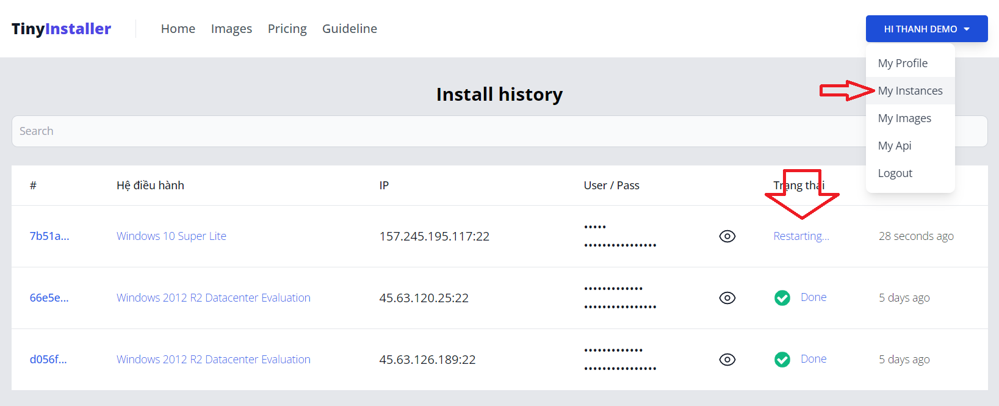

# Install Windows on Oracle Cloud

## Step 1 - Generate init script from TinyInstaller

<!--@include: ./_parts/generate-init-script.md-->

## Step 2 - Create Windows VPS on Oracle Cloud with Init Script

### Create new VM Instance

Login to Oracle Cloud then click CREATE INSTANCE

### Choose Image and shape

Choose Ubuntu image, and AMD/Intel shape

### Set the initialization script

Scroll to bottom of page click on "Show advanced options" -> Management tab, then paste init script from TinyInstaller into Automation - Startup script

### Create VM

Finally click CREATE button to create VM

### Instance created

After instance created we go back to TinyInstaller -> Deployment History to check install status

## Step 3 - Check install status

You can monitor install processes at [Deployment History](https://tinyinstaller.top/account/instances)

You can view status detail by click the link on status column

## Step 4 - Access to Windows

When installation done, you can copy it and access to RDP

That's all, you now connect to windows via RDP. Everything is processed automatically.

