# Install Windows on Vultr

## Step 1 - Generate init script from TinyInstaller

<!--@include: ./_parts/generate-init-script.md-->

## Step 2 - Create Windows VPS on Vultr with Init Script

#### Login to Vultr Account

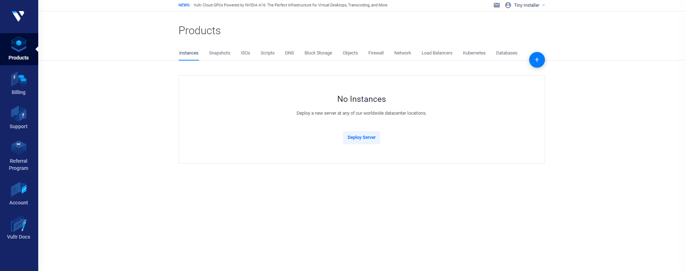

#### Deploy Server

1. From vultr dashboard just click + or Deploy Server
2. Select any location and server size you want
3. At Server Image please make sure you select "**Debian**"

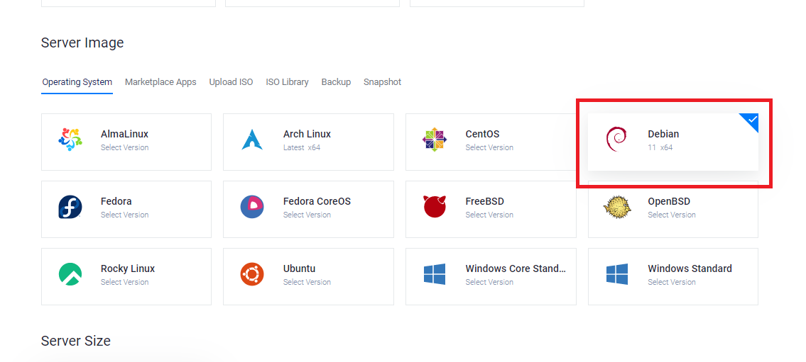

Enable Cloud-Init and paste init script which copy from step 1.

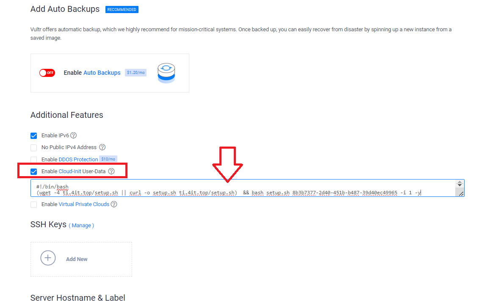

Select Qty then click Deploy Now

Note: the number of servers should not exceed Max install process on your TinyInstaller's key

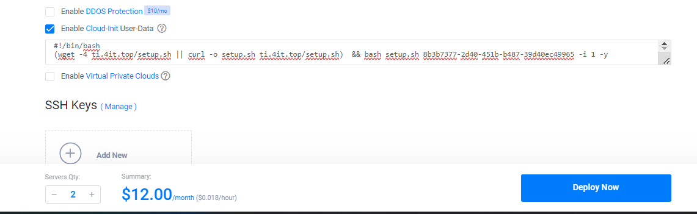

#### Wait for instances

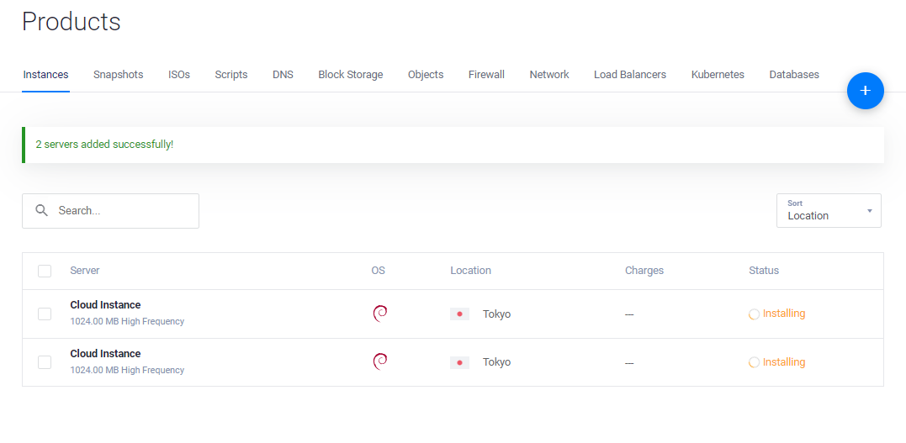

## Step 3 - Check install status

You can monitor install processes at [Deployment History](https://tinyinstaller.top/account/instances)

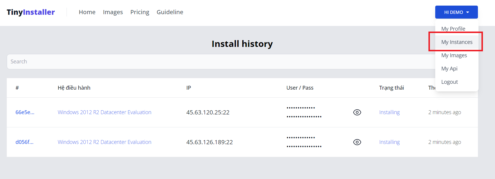

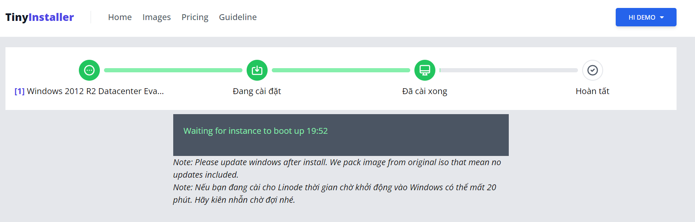

## Step 4 - Access to Windows

When installation done, you can copy it and access to RDP

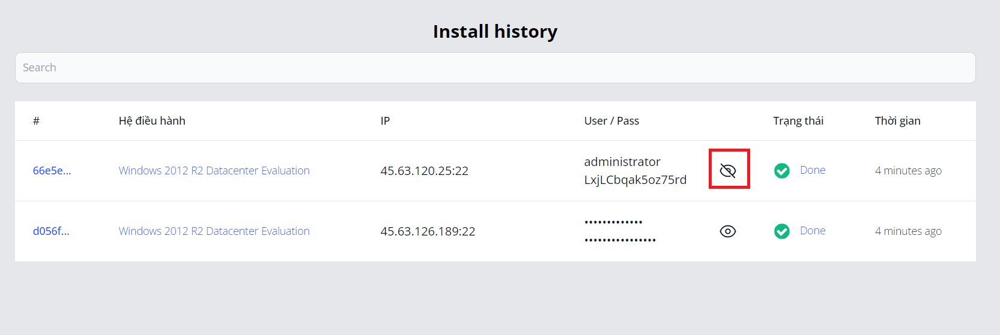

Open Remote Desktop Connection app

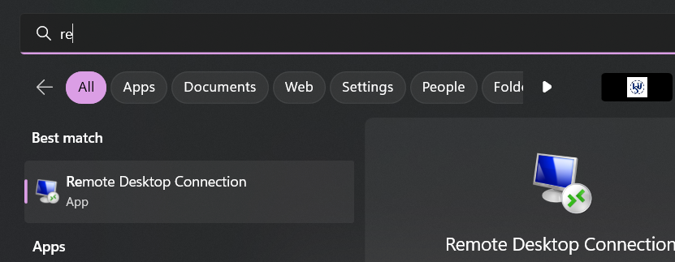

Copy and input IP address need to copy port as well then click connect

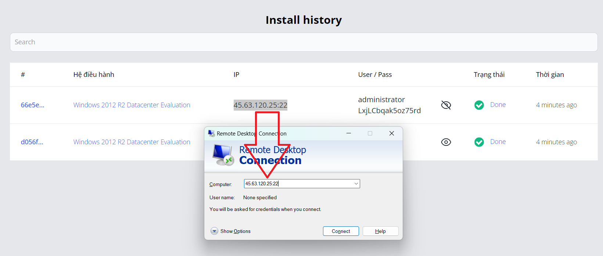

Input credentials then click OK

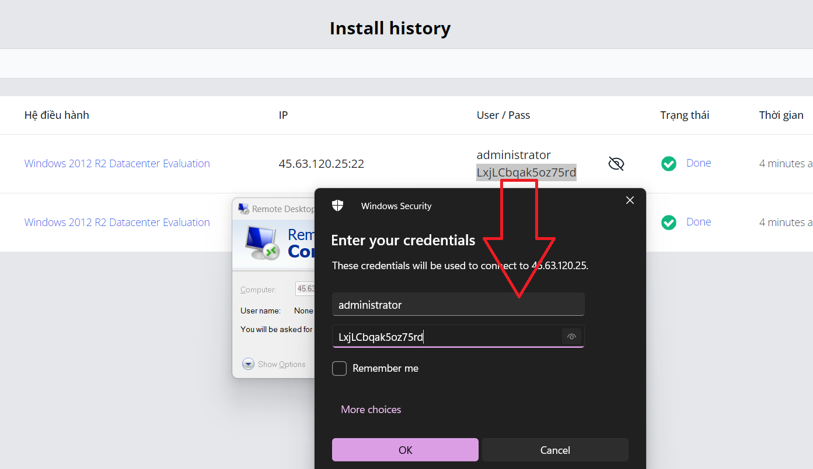

That's all, you now connect to windows via RDP. Everything is processed automatically.

