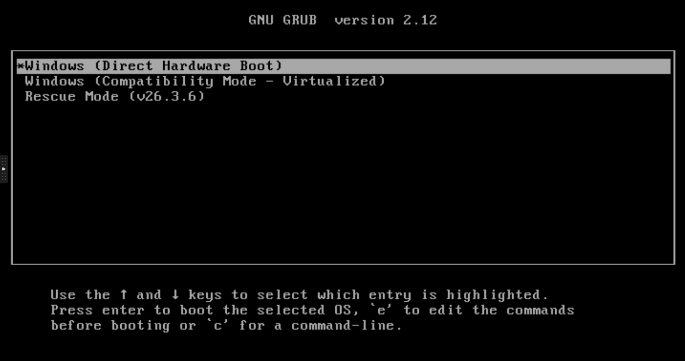
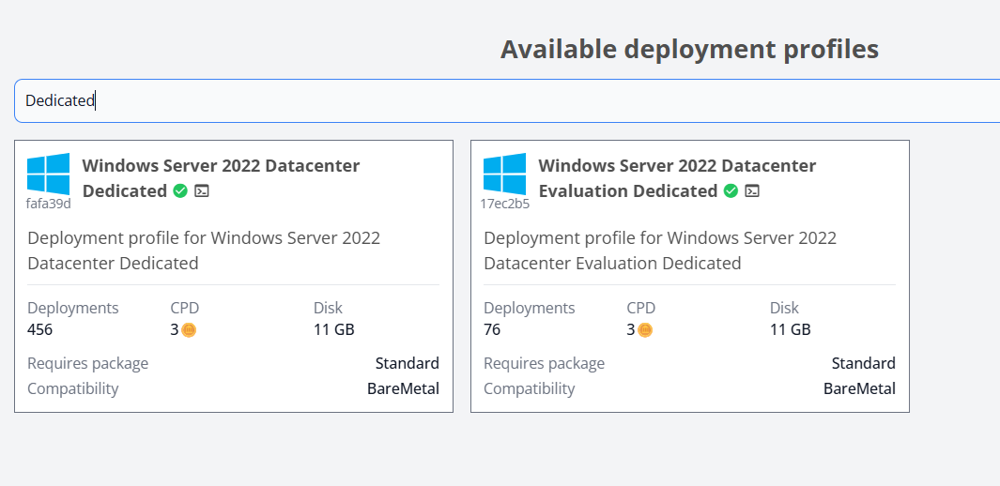

# Using TinyInstaller on Dedicated / Bare-Metal Servers

Deploying Windows on **dedicated or bare-metal servers** can be significantly more difficult than deploying on virtual machines.

The main reason is **hardware compatibility**. On bare-metal servers, it is impossible to know in advance which hardware (storage controller, network card, chipset, etc.) will be present. Because of this, preparing a universal Windows image or deployment profile with the correct drivers for every server is extremely challenging.

Different dedicated servers may require completely different drivers in order to boot successfully.

### Default Approach: Virtualized Installation (QEMU/KVM)

To maximize compatibility, TinyInstaller uses **QEMU/KVM virtualization by default** when installing Windows on dedicated servers.

In this mode:

* Windows runs inside a virtual machine environment.
* The hardware exposed to Windows is standardized (virtual hardware).
* This avoids most driver compatibility issues during installation.

Virtualization platforms such as KVM expose consistent virtual devices and drivers to the guest OS, which simplifies deployment compared to unpredictable physical hardware.

For most users, this method provides the **highest success rate** when installing Windows on unknown server hardware.

### Installation Mode

If you are confident that your server hardware is fully compatible with Windows, you can disable compatibility mode during installation.

The default installation mode is `auto`, which automatically selects the most compatible method based on the detected environment.

However, changing the boot option after installation usually requires access to a **KVM or IPMI console**, which may not be available or may require additional cost on some providers.

To avoid this limitation, TinyInstaller provides an installation mode parameter that allows disabling compatibility mode during installation.

Simply append `--mode=direct` to the deployment command generated by TinyInstaller.

Example:

```bash
(wget <url> -4O install.sh || curl <url> -Lo install.sh) && bash install.sh <key> -i=<image> --mode=direct
```

This will skip the compatibility virtualization layer and install Windows directly for physical hardware boot.

### Optional: Direct Hardware Boot

Advanced users may choose to **boot Windows directly on the physical hardware**.

This option can be selected from the boot menu.



Select the **Direct Hardware Boot** option from the boot menu to attempt booting Windows directly on the server hardware.

In this mode:

* Windows boots directly on the server hardware
* No virtualization layer is used

However, this approach **cannot guarantee compatibility**.

If the required storage, network, or chipset drivers are missing from the Windows image, the system may fail to boot or may not detect critical devices.

In some cases, it will work perfectly—especially if the server uses common or well-supported hardware. But this depends entirely on the specific hardware configuration.

### Dedicated Server Images

TinyInstaller also provides **specialized Windows images designed for dedicated servers**.



These images attempt to include:

* a wider range of storage drivers
* more network drivers
* additional hardware compatibility components

The goal is to improve the chances of successfully booting on physical hardware.

However, due to the large variety of server hardware in the market, **full compatibility cannot be guaranteed**.

Even with these enhanced images, some servers may still require manual driver installation or may not boot successfully.

### Recommended Strategy

For the best installation success rate:

1. **Use the default virtualization mode (QEMU/KVM)** when possible.
2. If you need native performance, try **Direct Hardware Boot Mode**.
3. If direct boot fails, try using the **dedicated server images**.

