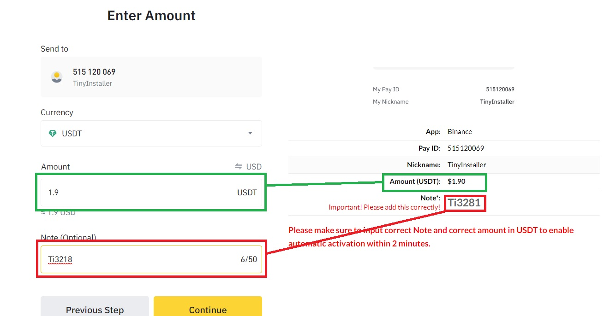
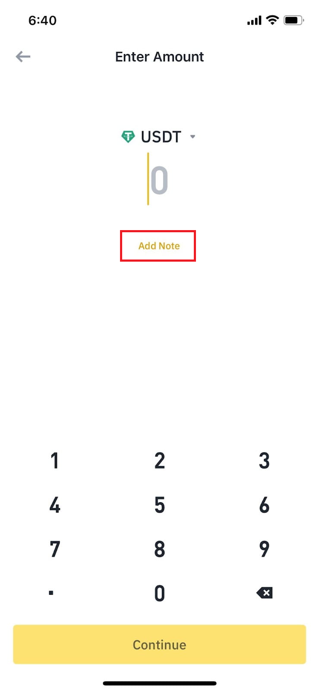
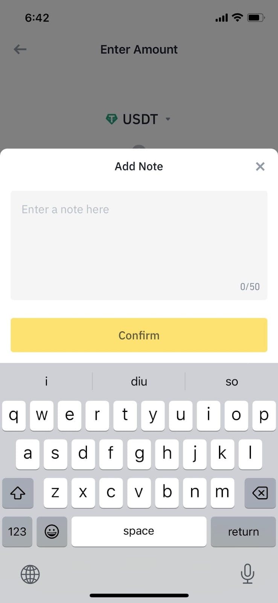

# Pay with Binance

It's very important to set the Note when pay with binance. Without valid note order cannot be confirmed automatically. And we only **accept USDT** do not pay in other currency like BTC

## How to pay on web

Make sure you input correct amount in **USDT** and **Note** before payment

## How to pay on mobile

1. Open Binance pay app
2. Scan Qr code on website
3. Tap on amount input amount
4. Tap on Add Note and input the note (should be in Ti+number format e.g. Ti1234)

If you forgot to write a note, please submit your order information at [https://my.tinyinstaller.top/payment-confirmation/](https://my.tinyinstaller.top/payment-confirmation/) for manual review and confirmation.

