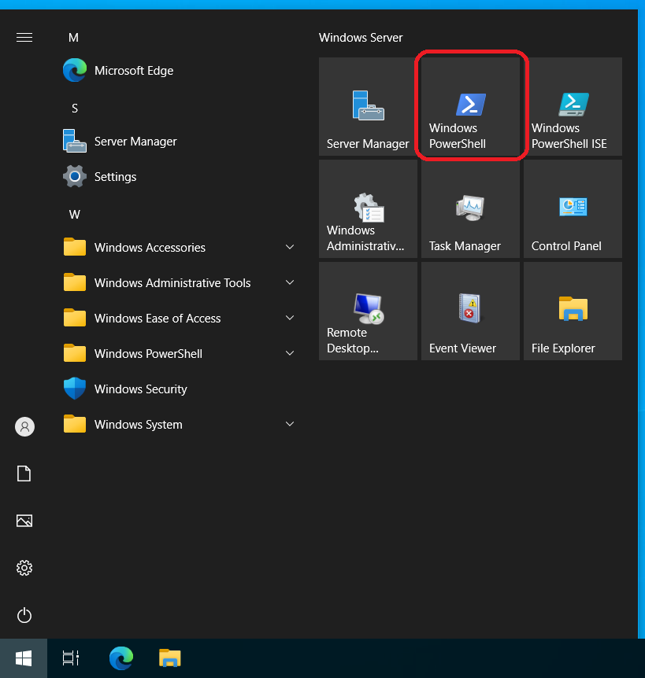

# Change RDP Port

## Open Powershell



### Please execute the commands below in PowerShell to modify the RDP port (replace '3389' with your desired port number).

```powershell
$rdpPort = 3389
$keyPath = "HKLM:\System\CurrentControlSet\Control\Terminal Server\WinStations\RDP-Tcp"
Set-ItemProperty -Path $keyPath -Name "PortNumber" -Value $rdpPort -Type DWORD
New-NetFirewallRule -DisplayName "Remote Desktop" -Direction Inbound -Protocol TCP -LocalPort $rdpPort -Action Allow -Enabled True
Restart-Service TermService -Force
```

