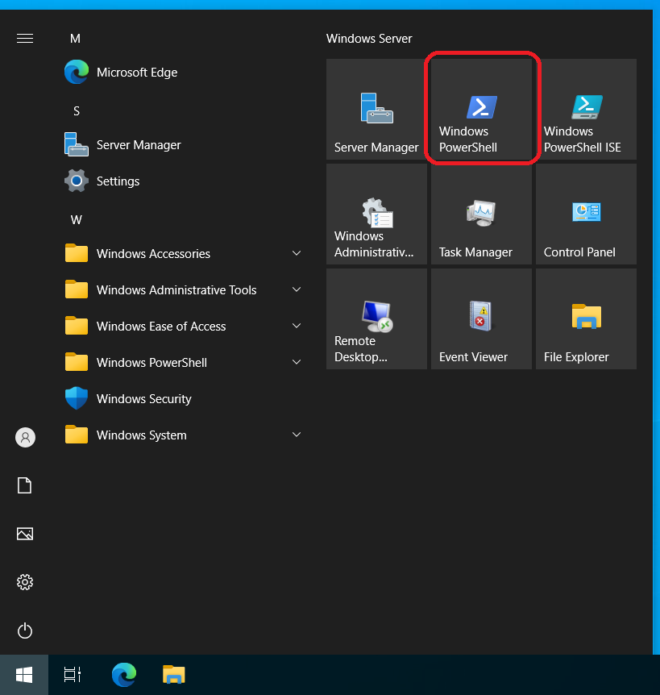
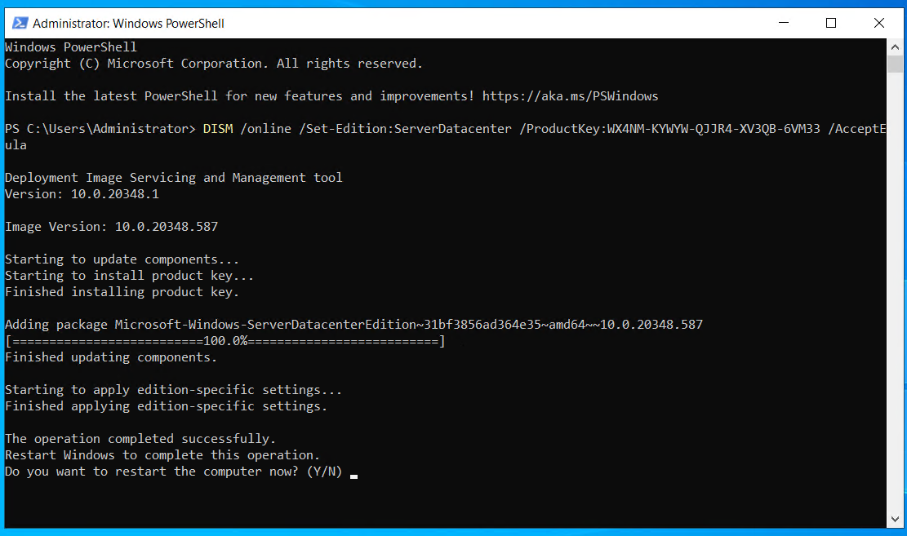
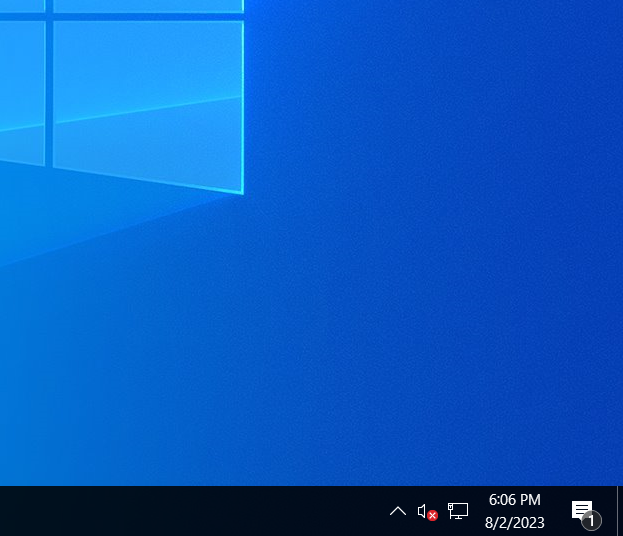

# Convert Windows Server Evaluation to Non-Evaluation Edition (Datacenter / Standard)

::: warning Licensing Notice

The product keys used in this guide are official Microsoft generic setup keys used only for edition conversion.

These keys do **NOT** activate Windows and do **NOT** grant a license.

A valid Windows Server license is still required for activation.

:::

## Steps to do

* Launch a PowerShell as an Administrator



* Type DISM /online /Set-Edition:\<TargetEdition> /ProductKey:\<SetupKey> and press ENTER

<figure>

<figcaption>Answer y to reboot</figcaption>
</figure>

<figure>

<figcaption>
After reboot, verify that the current edition matches the target edition (ServerStandard or ServerDatacenter).
</figcaption>
</figure>


## Official Microsoft Setup Keys (for edition conversion only)

### Windows 2012R2 Datacenter

```bat
DISM /online /Set-Edition:ServerDatacenter /ProductKey:W3GGN-FT8W3-Y4M27-J84CP-Q3VJ9 /AcceptEula
```

### Windows 2016 Datacenter

```bat
DISM /online /Set-Edition:ServerDatacenter /ProductKey:CB7KF-BWN84-R7R2Y-793K2-8XDDG /AcceptEula
```

### Windows 2019 Datacenter

```bat
DISM /online /Set-Edition:ServerDatacenter /ProductKey:WMDGN-G9PQG-XVVXX-R3X43-63DFG /AcceptEula
``` 

### Windows 2022 Datacenter

```bat
DISM /online /Set-Edition:ServerDatacenter /ProductKey:WX4NM-KYWYW-QJJR4-XV3QB-6VM33 /AcceptEula
``` 

### Windows 2022 Standard

```bat
DISM /online /Set-Edition:ServerStandard /ProductKey:VDYBN-27WPP-V4HQT-9VMD4-VMK7H /AcceptEula
```

### Windows 2025 Datacenter

```bat
DISM /online /Set-Edition:ServerDatacenter /ProductKey:D764K-2NDRG-47T6Q-P8T8W-YP6DF /AcceptEula
```

::: tip Licensing Reminder

This process only changes the Windows Server edition.

It does **NOT** activate Windows and does **NOT** provide a license.

You must purchase a valid Windows Server license from Microsoft or an authorized reseller to activate the system.

:::


